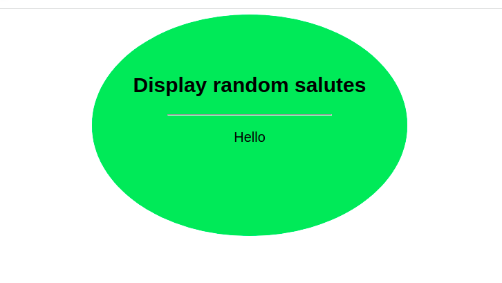

# Hello-react-rails

> This project is about getting our hands dirty with a Rails app with react. The main go is to connect a Rails and a React as one app, Rails for the backend, and React for the UI.



Additional description of the project and its features.

## Built With

- Rails-React gem
- Ruby
- Ruby on Rails

## Getting Started

To get a local copy up and running follow these simple example steps.

### Prerequisites

Ruby: 2.7.2
Rails: 6.1.4
Postgres: >=9.5
Node.js


## To get the local copy, run:

- `git clone` and paste : `https://github.com/elyor-doniyorov/hello-react-rails.git` 


### Setup

Instal gems with:

```
bundle install
npm i react_ujs
```

Setup database with:

```
   rails db:create
   rails db:migrate
   rails db:seed
```

### Usage

Start webpacker dev server with:

```
    ./bin/webpack-dev-server
```

Start server with:

```
    rails server
```

Open `http://localhost:3000/` in your browser.

## Author

👤 **Elyor Doniyorov**

- Github: [@elyor-doniyorov](https://github.com/elyor-doniyorov)
- LinkedIn: [@elyor-doniyorov](www.linkedin.com/in/elyor-doniyorov)

## Contributions

Contributions, issues and requests are welcome

## Show support

Give a star if you like the project